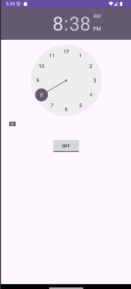

# ⏰ Android Alarm App

A simple Android app that lets users set a repeating alarm using a **TimePicker** and a **ToggleButton**. When the alarm goes off, it plays a ringtone and shows a toast message.

---

## 📱 Features

- 🕒 Set an alarm using a time picker
- 🔘 Toggle alarm on/off
- 🔔 Alarm rings and shows a toast message
- 🔁 Alarm repeats every 10 seconds (for testing/demo purposes)

---

## ⚙️ Requirements

- ✅ Android Studio
- 📱 Minimum SDK: 21 (Android 5.0 Lollipop)
- 🎯 Target SDK: 31 or above

---

## 🚀 How to Run

1. 📦 Clone or download this repository.
2. 🛠️ Open the project in **Android Studio**.
3. ▶️ Run the app on an emulator or Android device.
4. 🕹️ Use the `TimePicker` to set a time.
5. 💡 Tap the toggle button to turn the alarm **ON** or **OFF**.

---

## 📸 Screenshots (Optional)


---


## 🙌 Acknowledgements

This project is created as a simple demonstration of alarm and broadcast receiver functionality in Android.

---
### Installation

1. Clone the repository:

   ```bash
   git clone https://github.com/mycode05/Alarm_clock.git
   


